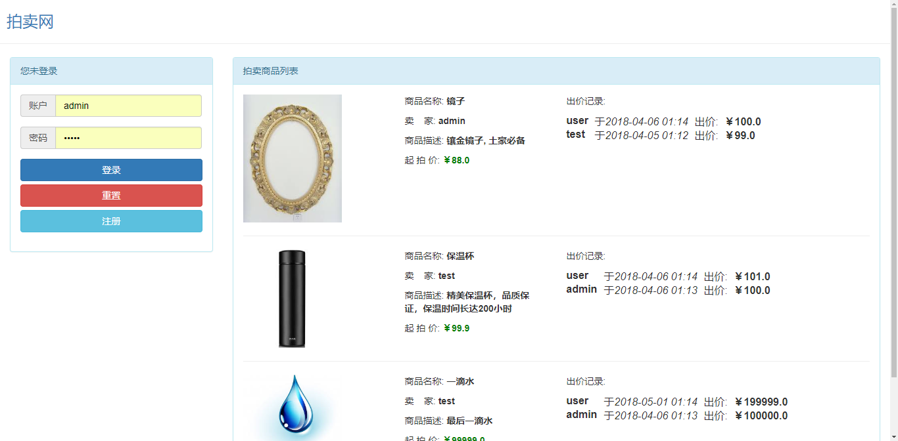
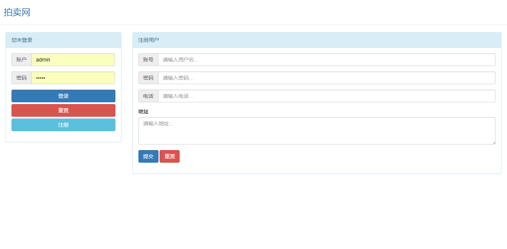
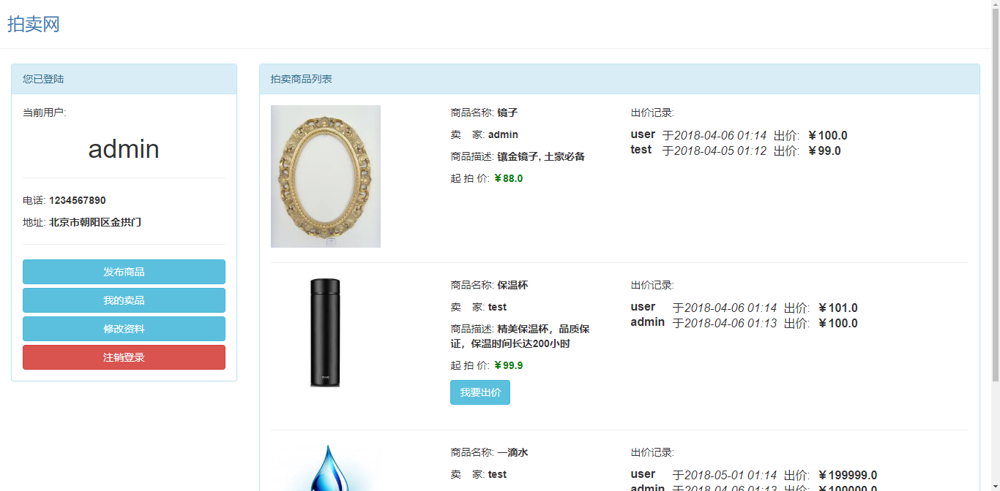
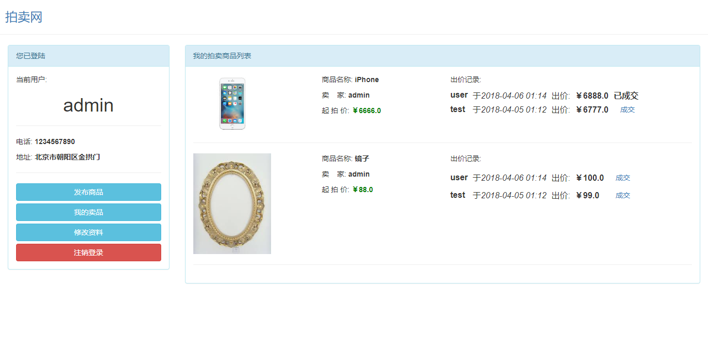
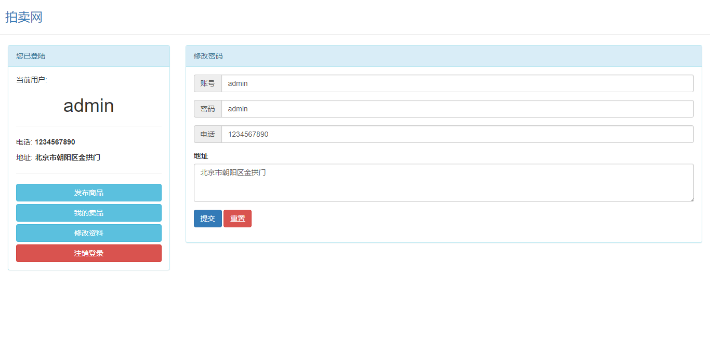
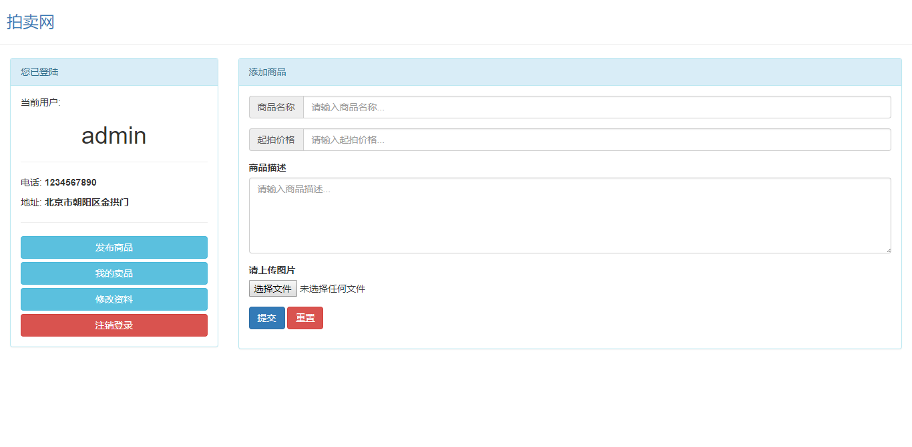
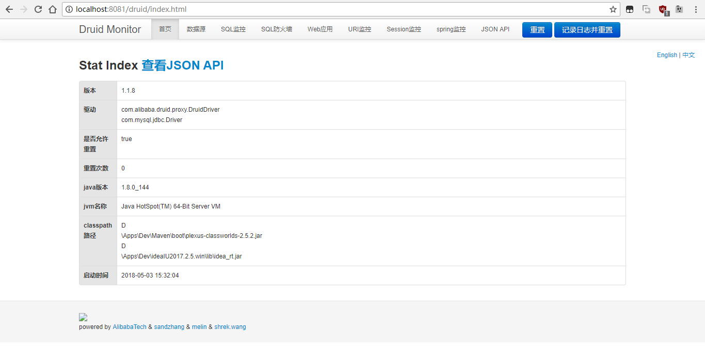
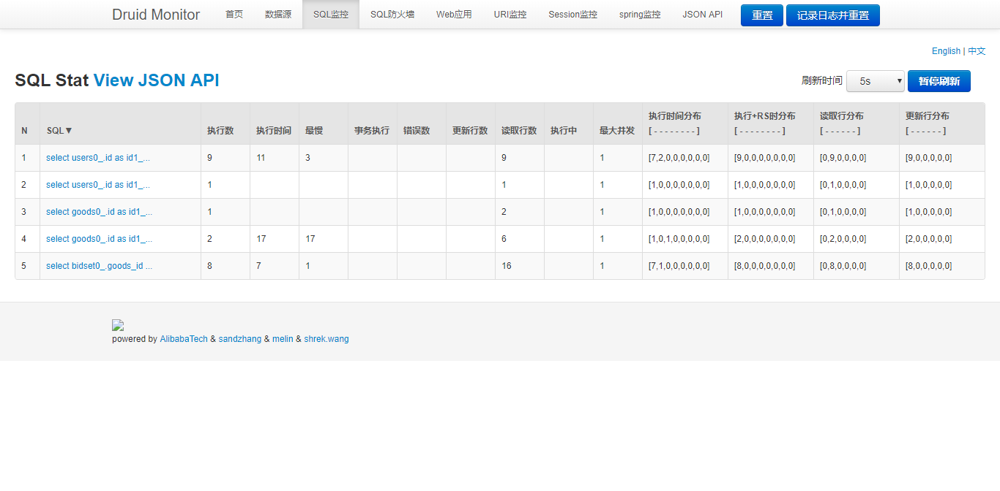

# Web Auction 网上拍卖

## 项目介绍

### 功能

- [x] 用户注册登录
- [x] 个人资料管理
- [x] 商品发布
- [x] 内容展示
- [x] 出价历史
- [x] 个人出价
- [x] 拍卖成交
- [x] 数据库可视化
- [ ] 修改商品内容
- [ ] 购物车
- [ ] 订单管理
- [ ] 评价管理
- [ ] 多描述、多图片
- [ ] 界面美化
等等

### 技术点
- 核心框架：Spring Framework
- Web框架：Struts2
- ORM框架：Hibernate
- 数据库连接池：Alibaba Druid
- 前端框架：Bootstrap
- 日志管理：Log4j2

### 截图
- 首页

- 注册

- 登录

- 我的商品

- 个人资料管理

- 新商品

- 数据库详情管理

- 数据库查询管理

- 等等